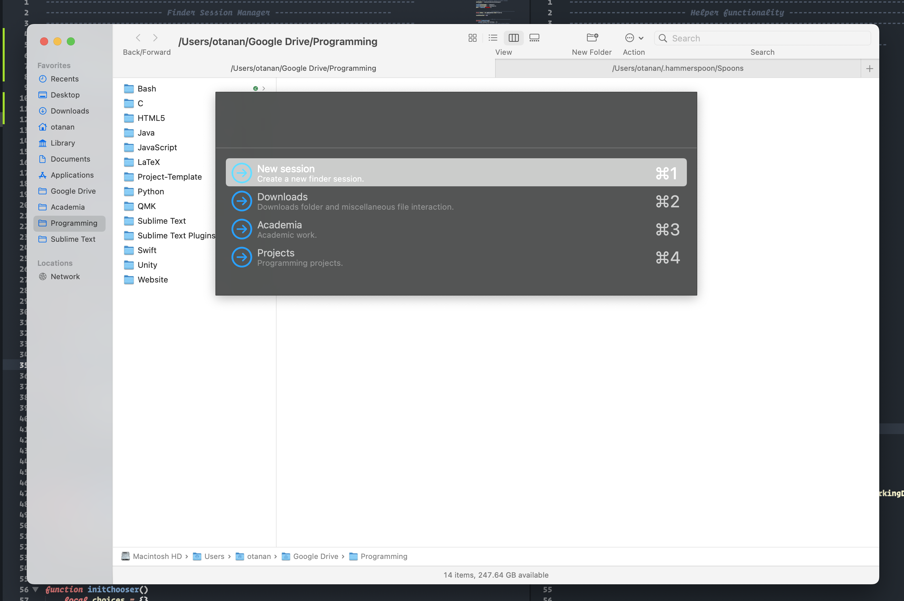

<!-- Filename:      README.md -->
<!-- Author:        Jonathan Delgado -->
<!-- Description:   GitHub README -->

<!-- Header -->
<h2 align="center">FinderSessionManager</h2>
 
  

    Session/tab manager for macOS Finder built on <a href="https://www.hammerspoon.org/">Hammerspoon</a>.
     
     
    Status: <em>in progress</em>
    <!-- Notion Roadmap link -->
    ·<a href="https://otanan.notion.site/Finder-session-manager-0d5360a4a2754726897c3ad4638a502a"><strong>
        Notion Roadmap »
    </strong></a>
  

<!-- Project Screenshot -->

Inspired by [Workona's](https://workona.com/) tab management system and [Sublime Text's](https://www.sublimetext.com/) own [project manager](https://packagecontrol.io/packages/ProjectManager).

<!-- ## Table of contents
* [Contact](#contact)
* [Acknowledgments](#acknowledgments) -->

## Contact
Created by [Jonathan Delgado](https://jdelgado.net/).

<!-- 
<a href="#readme-top">Back to top</a>
 -->